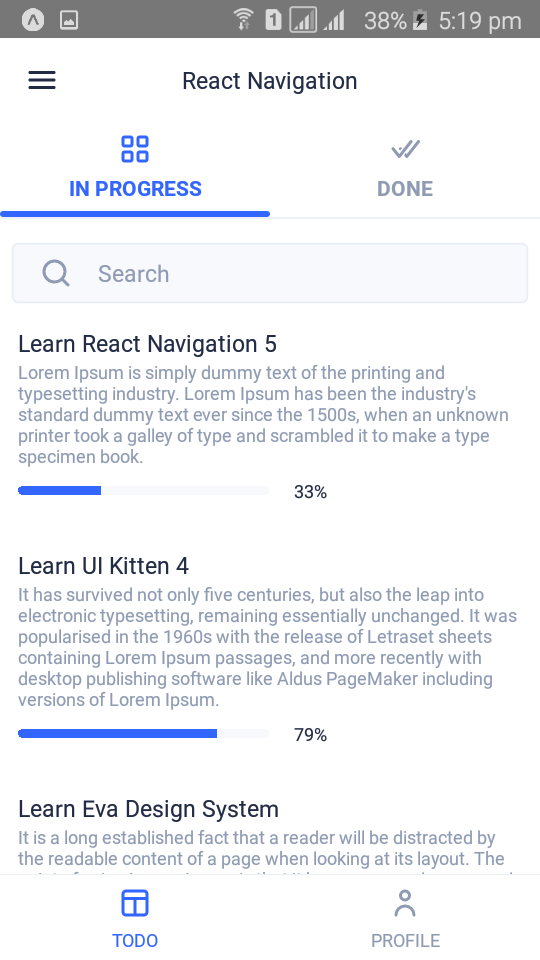

# Learning React Native Navigation v5

Following this awesome article - https://reactnavigation.org/blog/2019/11/04/using-react-navigation-5-with-ui-kitten/, I learned about react-navigation version 5 and also a lot about ui-kitten.

### Key Learnings -

- React Navigation v5, using the Stack, Drawer and Tab Components.
- TypeScript types for Nested Routes in React Navigation v5.
- Basic overview of using React Native UI Kitten Components.
- Theming.

